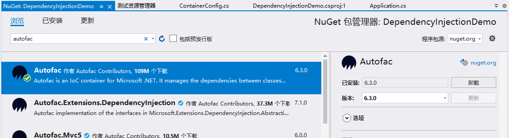
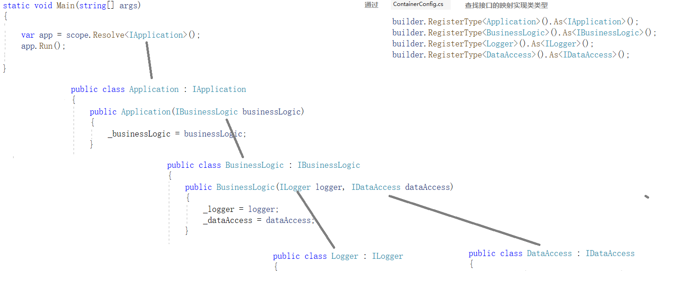

## Autofac使用介绍

在本示例代码的Solution文件夹实现了使用Dependency Injection方式编写的代码，使用了Autofac实现Dependency Injection。

从Start方案到Solution方案的简略步骤为：

1.打开项目NuGet Package包管理器，安装**Autofac**程序集。
    

1. 创建`Application`类，替代`Program.cs`中的`Main`方法对`businessLogic.ProcessData()`进行调用。
1. 为每一个类（`Logger`, `DataAccess`, `BusinessLogic`, `Application`）抽象出对应的接口。
1. 在Client项目中，添加`ContainerConfig.cs`文件，在此文件中实现接口与实现的映射关系，即在代码中构造器需要接口传入时，Autofac就默认创建一个映射实现类的对象传递进去。  
    在本项目中，`ContainerConfig.cs`文件的实现代码如下：
    ```CSharp
    public class ContainerConfig
    {
        using Autofac;
        using DemoLibrary;
        using DemoLibrary.Utilities;

        public static IContainer Configure()
        {
            var builder = new ContainerBuilder();

            builder.RegisterType<Application>().As<IApplication>();
            builder.RegisterType<BusinessLogic>().As<IBusinessLogic>();
            builder.RegisterType<Logger>().As<ILogger>();
            builder.RegisterType<DataAccess>().As<IDataAccess>();

            return builder.Build();
        }        
    }   
    ```
1. 在`Program.cs`文件中的入口方法中， 使用`container.BeginLifetimeScope()`创建一个`ILifetimeScope`的对应实现类的实例对象，再使用`ILifetimeScope.Resolve<IApplication>()`来创建一个`IApplication`的对应实现类的实例对象，然后使用某个`IApplication`实现类对象的`.Run()`触发程序运行。

    ```CSharp
    var container = ContainerConfig.Configure();

    using(var scope = container.BeginLifetimeScope())
    {
        var app = scope.Resolve<IApplication>();
        app.Run();
    }
    ```

## Autofac是如何工作的
接口变量只能通过具体的实现类来实例化为对象，在执行代码`scope.Resolve<IApplication>()`的时候，它的执行过程如下：
1. Autofac发现此处需要一个`IApplication`接口的某个实现类的对象。
1. 从`ContainerConfig.Configure()`处得知，凡是需要`IApplication`的地方，都用`Application`类型实例化。
1. 故此需要先调用`Application`类型的构造器。
1. 调用`Application`类的构造器时发现，需要传入`IBusinessLogic`接口的某个实现类的对象。
1. 再`ContainerConfig.Configure()`处得知，凡是需要`IBusinessLogic`的地方，都用`BusinessLogic`类型实例化。
1. 故此需要先调用`BusinessLogic`类型的构造器。
1. 调用`BusinessLogic`类的构造器时发现，需要传入`ILogger`接口的某个实现类的对象和`IDataAccess`接口的某个实现类的对象。
1. 再`ContainerConfig.Configure()`处得知：
    - 凡是需要`ILogger`的地方，都用`Logger`类型实例化。
    - 凡是需要`IDataAccess`的地方，都用`DataAccess`类型实例化。
1. 当调用`Logger`类型的构造器时，发现不需要其他参数，那么就实例化`Logger`对象返回。
1. 当调用`DataAccess`类型的构造器时，发现不需要其他参数，那么就实例化`DataAccess`对象返回。
1. 从而实例化`BusinessLogic`对象返回。
1. 从而实例化`Application`对象返回。

从而执行`app.Run()`代码来触发程序运行（此处`app`已经是`Application`类型对象）。  


Autofac工作示意图：  
